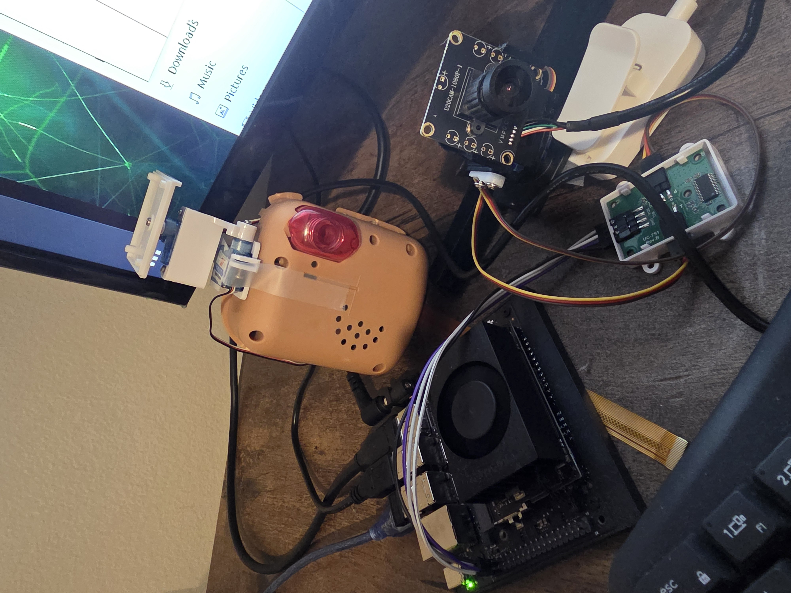
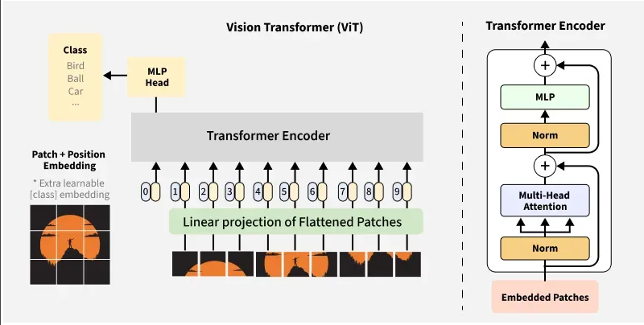
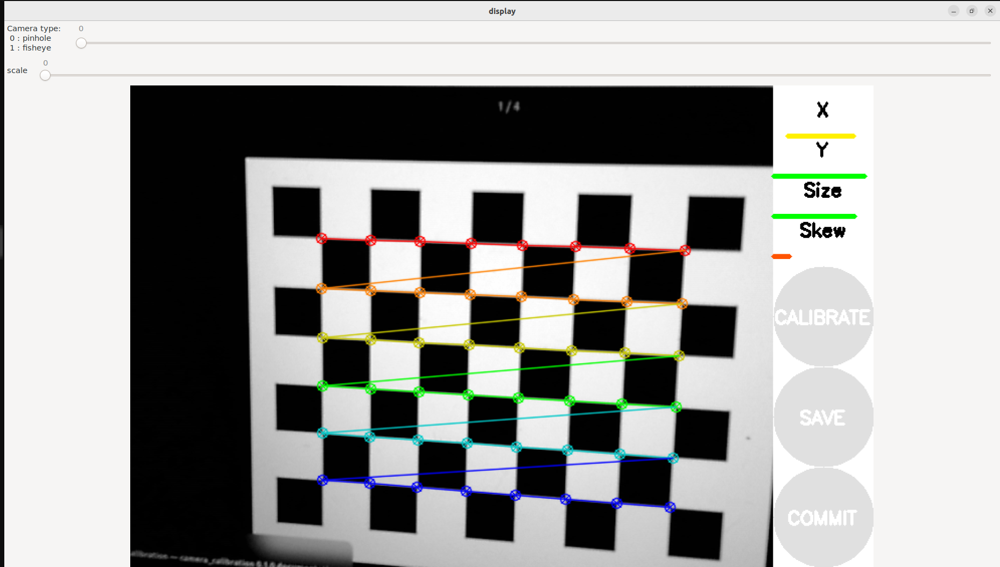

***

# Project Cara: Adaptive Personalized Emotion Recognition using Vision Transformers
**Technical Report & Architecture Overview**
**Author:** Elida Sensoy | **Platform:** NVIDIA Jetson Orin+ Arduino Nano / ROS 2 Humble
---
 Core Stack: TensorRT • ROS 2 Humble • Docker • ViT-based Emotion Recognition • Speech & Sentiment Analysis

### Overview
Cara is an embodied AI assistant designed to sense, interpret, and respond to human emotions.
 She integrates computer vision, speech recognition, and physical expression (blinking and head movement) to provide a warm, interactive companion: especially for people facing chronic illness, disability, or isolation.
The system runs entirely on the Jetson Orin Super, while an Arduino Nano controls servo-based facial actions.
 Cara learns user-specific emotion patterns through a personalized ViT model and self-updates via ROS 2 nodes in a Dockerized runtime.
 
*visual only video* 

https://github.com/user-attachments/assets/a8aa2465-ccae-42ef-9a75-2a4b4cbe6a95

**Key Features**

- Emotion Recognition -- Custom ViT-Tiny model fine-tuned to the user’s facial and motion expressions.


- Speech Understanding -- Microphone + Google Speech Recognition + Gemini LLM conversation loop.


- Emotional Expression -- Blinking, head movement, and LED feedback controlled via Arduino Nano (CH340 driver).


- Interactive Learning -- Continuously collects and labels emotion samples for personalization.


- Memory System --3 layered system supported by RAG flow. Logs and summarizes dialogue threads with Gemini’s summarization API.


- ROS 2 Integration -- Separate nodes for emotion_node, gaze_mapper, and servo_pca9685.


- Docker Runtime — GPU-accelerated container for stable development on Jetson Orin Super.

#### System Architecture
Hardware Assumptions
Component
Function
Jetson Orin Super
Main brain (GPU inference + ROS2 runtime)
USB Camera( Arduino U20CAM-1080P-1)
Vision input for emotion detection
Arduino Nano (CH340)
Servo & LED control
PCA9685 Servo Driver
PWM for pan/tilt motors
Speakers & USB Mic
Voice I/O
5 V Power Supply
Drives servos
Wi-Fi Dongle
Cloud API connection



### Quick Start (Development on Jetson Orin)
#### 1. Build image
docker compose build

#### 2. Start Cara runtime
docker run -it --rm --runtime nvidia --network host \
  -v $(pwd):/workspace/ros2_ws \
  cara_ros_node

#### 3. (Inside container)
cd /workspace && python3 cara.py

Before running, ensure /dev/ttyUSB0 (Arduino) exists.
 If not: sudo modprobe ch341 usbserial then replug the board.

  **Environment Variables**
Create a .env file in the project root:
```.env
    ELEVENLABS_API_KEY=<your-elevenlabs-key>
    GEMINI_API_KEY=<your-gemini-key>
    CARA_SERIAL_PORT=/dev/ttyUSB0
    UID=1000
    GID=1000
```

    Repo Structure
    cara/
    │── cara.py                        # Main runtime loop
    │── sentiment_detection.py          # Emotion inference (text)
    │── head_controller.py              # Servo actions
    │── serial_control.py               # Arduino serial link
    │── cara_audio_io.py                # Speech input/output
    │── training/
    │   └── Dockerfile                  # Training container for ViT
    │── jetson/
    │   ├── Dockerfile                  # Jetson runtime
    │   └── entrypoint.sh
    │── ros2_ws/
    │   └── src/cara_vision_control/    # ROS 2 emotion/head nodes
    │--- memory/
        │── cara_prompt.json                # Gemini persona prompt
        │── cara_memory.json                 # Persistent memory
        │── good_things.json              # Emotional summaries
        |-- profile.json
    │── docker-compose.yml
    └── requirements.txt


```

#make sure you are in dialout group
sudo usermod -a -G dialout $USER
newgrp dialout
/dev/ttyAMA0
```
How to see arduino on jetson:
```
ls /dev/ttyUSB* /dev/ttyAMA0* 2>/dev/null
arduino-cli monitor -p /dev/ttyAMA0
```
'''
### Wiring 
**battery**
 
    Battery + ------+---------> Motor +
                    |
                [Diode Stripe]
                    |
                    +---------> Motor -
                                |
                                [Collector] ← Transistor
                                |
    [Base] ← 220Ω ← D3 ← Arduino
                                |
                            [Emitter]
                                |
        Arduino GND ←─────┴─────── Battery –

 
 
**camera+pca9685**

        ┌───────────────────────────────┐
        │          JETSON NANO          │
        │        (40-pin Header)        │
        └───────────────────────────────┘
                 |      |      |      |
                 |      |      |      |
     Pin 2 or 4  |   Pin 6/9   |   Pin 5    |   Pin 3
       (5V)      |    (GND)    |   (SCL)    |   (SDA)
                 |      |      |      |
                 v      v      v      v
        ┌───────────────────────────────┐
        │           ARDUCAM             │
        │      (PCA9685 Servo Kit)      │
        └───────────────────────────────┘
                 ▲      ▲      ▲      ▲
                 |      |      |      |
        VCC  <───┘      |      |      |
        GND  <──────────┘      |      |
        SCL  <─────────────────┘      |
        SDA  <────────────────────────┘

              ┌─────────────────────┐
              │   SERVO OUTPUTS     │
              │ (S  V  G Headers)   │
              └─────────────────────┘
                      ▲     ▲
                      |     |
                Servo 1   Servo 2
                (S V G)   (S V G)

### 1. VIT Emotion Detection: Abstract
Standard facial emotion recognition models are trained on generic datasets (like FER-2013), often failing to capture the nuances of a specific user’s facial micro-expressions. Project Cara introduces a **Personalized Adaptive Vision System**. By utilizing a pre-trained Vision Transformer (ViT-Tiny) and implementing a lightweight, trainable adapter layer, the system performs real-time, on-device learning. This allows the robot to "learn" its owner's specific emotional cues via human-in-the-loop feedback, bridging the gap between raw perception and empathetic Human-Robot Interaction (HRI).

---

### 2. System Architecture
The pipeline operates within a distributed ROS 2 environment, ensuring modularity and low-latency performance suitable for edge computing.

#### 2.1 The Perception Stage
1.  **Input:** 640x480 video stream at 30 FPS.
2.  **Detection (Face-YuNet):** A lightweight CNN-based detector locates the face.
3.  **Preprocessing:** The face is cropped, resized to 224x224, and normalized. This region of interest (ROI) is passed to the inference engine.

#### 2.2 The Inference Engine (ViT)
We utilize `vit-tiny-patch16-224` for its balance of speed and accuracy. Unlike Convolutional Neural Networks (CNNs) that process pixels in local windows, the ViT processes the image as a sequence of patches, allowing it to understand global context (e.g., how the eyes relate to the mouth) immediately.

---

### 3. Under the Hood: The Vision Transformer (ViT)
To understand how Cara "sees," we must look at the Transformer architecture.


 


#### 3.1 Patch Embeddings
The Transformer cannot process a raw grid of pixels. Instead, the 224x224 face image is sliced into **196 fixed-size patches** (each 16x16 pixels).
* **Analogy:** Imagine cutting a photograph into puzzle pieces.
* **Linear Projection:** Each patch is flattened into a vector and mapped to a specific dimension (embedding size).

#### 3.2 Positional Embeddings
Because the Transformer processes these patches in parallel (not sequentially), it loses the concept of "up," "down," "left," or "right."
* **The Fix:** We add **Positional Embeddings** to the patch vectors. This effectively "tags" each puzzle piece with its coordinate, so the model knows the forehead patch is above the eye patch.

#### 3.3 The Self-Attention Mechanism
This is the core engine. The mechanism, mathematically represented as:
$$\text{Attention}(Q, K, V) = \text{softmax}\left(\frac{QK^T}{\sqrt{d_k}}\right)V$$

* **Query (Q):** What the model is looking for (e.g., "Are there crinkles?").
* **Key (K):** What the patch contains (e.g., "I am an eye corner").
* **Value (V):** The actual information content.

**How it works for Cara:**
When Cara analyzes a "smile," the attention mechanism allows the mouth patches to "attend to" the eye patches. It recognizes that a smile is not just a curved mouth, but a curved mouth *plus* crinkled eyes (Duchenne smile).

#### 3.4 The CLS Token
A special "Classification Token" is added to the start of the sequence. As the data moves through the Transformer layers, this token aggregates information from all other patches. By the final layer, this single token holds the semantic representation of the entire face.

---

### 4. Personalized Adaptation Strategy
Training a Transformer from scratch requires millions of images and massive compute. To run this on a Jetson Orin, we use **Transfer Learning with Parameter-Efficient Fine-Tuning (PEFT)**.

#### 4.1 Frozen Backbone
We freeze the weights of the base ViT model. This ensures Cara retains the general knowledge of what a "face" looks like (edges, textures, shapes) without catastrophic forgetting.

#### 4.2 The Trainable Adapter Head
We attach a custom Multi-Layer Perceptron (MLP) head to the output of the CLS token.
* **Input:** 192-dimensional feature vector from ViT.
* **Hidden Layers:** Linear -> LayerNorm -> GELU -> Dropout.
* **Output:** 7 probabilities (Happy, Sad, Angry, etc.).

**Why this matters:** When we run the "Train" command, we *only* update the weights of this small adapter head. This reduces the trainable parameters from millions to just a few thousand, enabling training to finish in seconds on the robot.

---

### 5. The Interactive Learning Loop
This feature allows Cara to evolve from a generic detector to a personal companion.


#### 5.1 Data Collection (The Trigger)
When the user triggers `/cara/feedback` (e.g., "I am happy"), the system performs **Latent Latching**:
1.  It retrieves the current frame from the buffer.
2.  It assigns the user-provided label as the "Ground Truth."
3.  It saves the pair to the local dataset.

#### 5.2 The Optimization Step
When `/cara/train` is triggered:
1.  **Batching:** The system loads the saved personal images.
2.  **Forward Pass:** Images run through the frozen ViT to get features.
3.  **Loss Calculation:** We use **Cross-Entropy Loss** to measure the difference between Cara's prediction and the user's label.
4.  **Backpropagation:** The error is propagated back, adjusting *only* the Adapter Head weights.

---

### 6. Future Integration: Vision-Language-Action (VLA)
The ultimate goal is to convert this perception into empathetic behavior. This moves the system from a standard classifier to a **Vision-Language-Action** model.

#### 6.1 Emotion as Contextual Prompting
Currently, Large Language Models (LLMs) like Llama-3 (running locally) lack visual context. We bridge this by injecting the emotion confidence score into the system prompt.

**Logic Flow:**
1.  **ViT Output:** `Primary: Sad, Confidence: 0.85`.
2.  **Prompt Injection:**
    > *System: The user appears significantly SAD (85%). Adjust response tone to be comforting, lower pitch, and slower.*
3.  **LLM Generation:** "I notice you seem a bit down. Do you want to talk about it?"

#### 6.2 Servo-Reflex Action
Simultaneously, the emotion state drives the `cara_head_controller`:
* **If Happy:** Increase head tracking speed (excitement).
* **If Sad:** Tilt head 15 degrees (empathy) and reduce movement speed.
#### 6.3 Blinking
Cara has an already implemented blinking system. With its eyelids moving, she can easily create engaged conversations with the user.
---1


### 7.0 Camera Calibration:
#### 7.0.1. Allow local root clients (like your container) to use your display
```
    xhost +local:root
```
then inside container
```
    echo $DISPLAY
```
*should match the host, e.g. ":0" or ":1"*
#### 7.0.2.Inside the container, run the camera alone:
```
ros2 run v4l2_camera v4l2_camera_node --ros-args \
  -p video_device:=/dev/video0 \
  -p image_size:="[640,480]" \
  -p pixel_format:=YUYV \
  -p output_encoding:=rgb8
```

**Then in another terminal:**
```		
ros2 topic echo /image_raw
```
The camera node might not start correctly, or the topic name doesn’t match.
```
apt-get update
apt-get install -y ros-humble-camera-calibration
```
#### 7.0.3.Calibrate Camera
```
ros2 run camera_calibration cameracalibrator \
  --size 8x6 --square 0.024 \
  --ros-args -r image:=/image_raw -r camera:=/camera
```


 
Use a black white grid the calibrate the camera as shown above.(until skew, x,y and size calibrates).Click configure and save. Save the configuration .yaml file. Don't forget to copy it from temp to the root/camera_info/..)

#### Troubleshoot
If you can't see the GUI or black screen only:
the first terminal:
```
ros2 run v4l2_camera v4l2_camera_node --ros-args -p video_device:=/dev/video0
```
.. leave that running

Inside a second shell
```
cd ~/cara
docker compose exec cara_runtime bash

source /opt/ros/humble/setup.bash
cd /workspace/ros2_ws
source install/setup.bash

ros2 run rqt_image_view rqt_image_view
```
a window will pop up. in the dropdown choose /image_raw or whatever image topic you set to your launch.  

 
 
### 7.1 How to Run:
 
- Step 1: Start/ Build Docker, enter the container.
``` 
docker compose build cara_runtime
docker compose up -d cara_runtime  
docker compose exec cara_runtime bash
```
- Step 2: Apply & Run

Rebuild one time (or whenever you change the code):
Bash
```		
cd /workspace/ros2_ws
colcon build --packages-select cara_vision_control
source install/setup.bash
```
#### 7.1: The "Teach Cara" Workflow:  

Now we have a full loop. Here is how you use it:

    Start your nodes (Camera, YuNet, Emotion Node).
   ``` 		
    
    ros2 launch cara_gaze_control model_gaze.launch.py use_servos:=true
    #on another terminal:
    source /opt/ros/humble/setup.bash
    cd /workspace/ros2_ws
    source install/setup.bash
    ros2 run cara_vision_control emotion_node
   ```


##### 7.1.0 Collect Samples: Make a happy face and run:
   
``` Bash
ros2 topic pub --once /cara/feedback std_msgs/msg/String "{data: 'happy'}"
```
Make a surprised face and run:

```Bash
ros2 topic pub --once /cara/feedback std_msgs/msg/String "{data: 'surprise'}"
```
(Collect at least 200-300 samples total).
")

##### 7.1.1 Triggering On-Device Training

Once enough samples have been collected, instruct Cara to begin training:

*Trigger Training:* When you are ready for her to learn, run this:
 
```
    ros2 topic pub --once /cara/train std_msgs/msg/Bool "{data: true}"
```

After training finishes, the system resumes real-time inference. The next time you present the same expressions, you should observe a substantial increase in classification confidence because the model is now tuned to your personal facial features.

**During sample collection:**
- The emotion_node terminal will pause and report progress through the 10 training epochs: Watch the terminal where emotion_node is running. You will see it pause, print Epoch 1/10 Loss: ..., and then resume. The next time you make that face, the confidence score should be much higher!
 
```
    root@elida:/workspace/ros2_ws# ros2 run cara_vision_control emotion_node
    [INFO] [1765158933.595680456] [cara_emotion_node]: Loading ViT Model...
    [INFO] [1765158935.485379668] [cara_emotion_node]: Model loaded on cuda
    Saved sample: happy
    [INFO] [1765158964.033491054] [cara_emotion_node]: SAVED: happy
    Saved sample: surprise
    [INFO] [1765159002.919448048] [cara_emotion_node]: SAVED: surprise
```
 
**During training (with >200 personalized samples):**
```
Loading 240 samples from disk...
Starting training on 140 samples...
Epoch 1/10 Loss: 1.2610
Epoch 2/10 Loss: 1.1760
Epoch 3/10 Loss: 1.0928
Epoch 4/10 Loss: 1.0588
Epoch 5/10 Loss: 0.9872
Epoch 6/10 Loss: 0.9285
Epoch 7/10 Loss: 0.8938
Epoch 8/10 Loss: 0.8458
Epoch 9/10 Loss: 0.7868
Epoch 10/10 Loss: 0.7480
Training complete!
[INFO] [1765226520.522446960] [cara_emotion_node]: --- TRAINING SUCCESSFUL ---

```

##### Interpretation of Results

**The consistent downward trend in training loss—from 1.26 -> 0.74—indicates that the model is successfully adjusting its internal weights to match your personal expression patterns.**

In practical terms:

Early epochs show high loss because the model is still mismatching your expressions.

As training progresses, the model becomes better at extracting stable features from your face (mouth curvature, eye widening, cheek tension, etc.).

The final loss stabilizing in the ~0.7 range suggests the classifier has formed a reliable boundary between your “happy” and “surprise” samples.

In real-time use, this manifests as:

- Higher confidence values,

- Fewer misclassifications, and

- Faster responsiveness,
because the model now treats the user's face as its “native distribution.”

This is exactly the advantage of personalized micro-models: even with a lightweight ViT backbone running on a Jetson, training with a specific user's own data lets Cara become more accurate and more emotionally attuned to the user specifically. 

#### the video test (click around the timeline if video gets stuck between frames)

https://github.com/user-attachments/assets/9401abef-96b8-4713-8e0d-920b07200774
 
## 7. Conclusion
Project Cara demonstrates that complex, Transformer-based architectures can be adapted for personalized, edge-based robotics. By decoupling the feature extraction (Frozen ViT) from the classification (Personal Adapter), we achieve a system that is both computationally efficient and highly adaptive to the specific emotional expressions of its human companion.


 Acknowledgments
Jetson Orin L4T and NVIDIA JetPack 6.2


Arduino CH340 Serial Driver


Hugging Face / Transformers • ElevenLabs • Google Gemini


Guidance from the University of Michigan Robotics Department  and Open-Source community.
 

